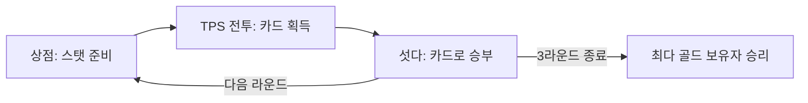

# 🤠 도파민 어딕션 (Dopamine Addiction)

> TPS 배틀로얄 ↔ 전통 카드게임(섯다) ↔ 상점 성장이 라운드 단위로 순환하는
> **언리얼 엔진 5 데디케이티드 서버 멀티플레이어** 게임.

이 문서는 포트폴리오로 이 저장소를 보러 온 사람이 프로젝트를 빠르게 이해하고,
설명 옆의 링크를 눌러 곧바로 실제 코드로 이동할 수 있도록 만든 안내 문서다.

| 항목 | 내용 |
| --- | --- |
| 엔진 | Unreal Engine 5, C++ (Dedicated Server 기반 멀티플레이어) |
| 장르 | 3인칭 슈팅 액션 + 전통 카드(섯다) + 상점 성장 하이브리드 |
| 팀 구성 | 4인 팀 (본인 담당: **클라이언트 프로그래머**) |
| 개발 기간 | 2025-09-01 ~ 2026-09-05 |
| 플레이 방식 | 온라인 멀티플레이(데디케이티드 서버), 3라운드제 |
| 데모 영상 | [YouTube](https://youtu.be/Gi9b-EheNaE) |
| 저장소 | [github.com/KuroaLime/dopamine_addiction](https://github.com/KuroaLime/dopamine_addiction/tree/Gil_Refactoring) |

---

## 1. 게임 소개

한 매치는 총 **3라운드**로 진행되고, 각 라운드는 아래 순서를 반복한다.
3라운드가 끝난 시점에 가장 많은 골드를 보유한 플레이어가 승리한다(동률이면 공동 우승).



서로 다른 장르(전투/카드/성장)를 하나의 순환 구조로 엮어서, 전투로만 얻을 수 있는 자원(카드)과
전투만으로는 못 얻는 승부(섯다의 심리전)가 서로 맞물리며 한 라운드 안에서도 판도가 여러 번 바뀐다.

| 단계 | 설명 | 핵심 코드 |
| --- | --- | --- |
| **TPS 전투** | 모든 플레이어가 같은 맵에서 총기 교전. 무피격 상태가 이어지면 체력이 서서히 재생된다. 이전 섯다에서 얻은 카드가 맵 위 섬에 드롭돼 있어 교전 중 직접 주워야 한다. | [MainCharacter](Project/Manager/Source/Manager/Game/InGame/MainCharacter.cpp), [Weapon](Project/Manager/Source/Manager/Game/InGame/TPS/Actor/Weapon/Weapon.cpp), [HealthRegenComponent](Project/Manager/Source/Manager/Game/InGame/TPS/System/HealthRegenComponent.cpp), [TPSPhaseStrategy](Project/Manager/Source/Manager/Game/InGame/TPS/System/TPSPhaseStrategy.cpp) |
| **섯다(카드) 게임** | 화투 두 장짜리 전통 섯다 규칙(광땡→땡→알리/독사 등 특수조합→끗, 땡잡이·암행어사 같은 반전 패)과 체크/콜/쿼터/하프/따당/삥/다이/올인 베팅을 그대로 구현. | [SeotdaRuleService](Project/Manager/Source/Manager/Game/InGame/Card/SeotdaRuleService.cpp), [CardGameService](Project/Manager/Source/Manager/Game/InGame/Card/CardGameService.cpp), [CardPhaseStrategy](Project/Manager/Source/Manager/Game/InGame/Card/CardPhaseStrategy.cpp), [SeotdaTypes.h](Project/Manager/Source/Manager/Game/InGame/Card/Data/SeotdaTypes.h) |
| **상점 & 성장** | 보유 골드로 캐릭터 고정 스탯을 올리는 카드 강화(무작위 3장 중 선택)와, 더 저렴하지만 증가폭이 작은 무기 스탯 개조(5종 중 무작위 3종) 두 경로로 성장한다. | [Ability_Shop](Project/Manager/Source/Manager/Default/Ability/Ability_Shop.cpp), [ShopWidget](Project/Manager/Source/Manager/Game/InGame/TPS/UI/Shop/ShopWidget.cpp), [ShopInputHandler](Project/Manager/Source/Manager/Game/InGame/TPS/System/ShopInputHandler.cpp) |
| **황금 고블린** | 전투 중 드물게 등장하는 레어 몬스터. 처치 시 상당한 골드를 보상으로 준다. | [GoldenGoblinDirectorComponent](Project/Manager/Source/Manager/Game/InGame/TPS/Actor/Monster/GoldenGoblin/GoldenGoblinDirectorComponent.cpp), [GoldenGoblinAIController](Project/Manager/Source/Manager/Game/InGame/TPS/Actor/Monster/GoldenGoblin/GoldenGoblinAIController.cpp) |

---

## 2. 아키텍처 개요

```
로그인/로비 ── IOCP 서버(raw winsock, C++) ── 별도 프로세스
        │  (계정 인증, 방 생성/입장)
        ▼
인게임 ── 언리얼 데디케이티드 서버로 핸드오버
        │
        ├─ AMainGameMode           ── 얇은 Context / 오케스트레이터 (페이즈 머신, 라이프사이클, 접속 관리)
        │    ├─ UTPSPhaseStrategy / UCardPhaseStrategy  ── 페이즈 진입/종료 오케스트레이션
        │    ├─ FSeotdaRuleService                       ── 섯다 패 평가 (순수 함수)
        │    ├─ FCardPlacementService                    ── 카드 배치(섬 위 드롭 위치 계산)
        │    └─ UCardGameService                          ── 카드/섯다 상태 + 도메인 로직
        │
        ├─ MainGameState / MainPlayerState  ── 복제 상태(라운드, 타이머), 개인 상태(골드, 카드, 업그레이드)
        └─ 캐릭터 행동 = 전부 자체 제작 GAS(PFGASC/PFGAbility) 어빌리티
             (Jump / Fire / Aim / Reload / PickUp / Shop / Crouch / Death / Respawn)
```

- **캐릭터 행동의 GAS 일원화**: [Default/Ability/](Project/Manager/Source/Manager/Default/Ability) 아래 각 `Ability_*` 클래스, GAS 코어는 [Ability/GAS/](Project/Manager/Source/Manager/Default/Ability/GAS)의 `PFGASC`(AbilitySystemComponent), `PFGAbility`, `PFGAttributeSet`.
- **게임 흐름 = 페이즈 전략 패턴**: [PhaseStrategy.h](Project/Manager/Source/Manager/Game/InGame/PhaseStrategy.h)를 기반으로 [TPSPhaseStrategy](Project/Manager/Source/Manager/Game/InGame/TPS/System/TPSPhaseStrategy.cpp) / [CardPhaseStrategy](Project/Manager/Source/Manager/Game/InGame/Card/CardPhaseStrategy.cpp)가 각 페이즈의 셋업·정리를 담당한다.
- **로그인/로비 서버**: 언리얼과 별개인 [Server/IOCP_Server](Project/Manager/Server) — [ServerMain.cpp](Project/Manager/Server/ServerMain.cpp), [LobbyService](Project/Manager/Server/LobbyService.cpp), [NetApi](Project/Manager/Server/NetApi.cpp).
- 이번 `Gil_Refactoring` 브랜치에서 진행한 게임모드 분리·GAS 일원화·레거시 정리 전체 기록은
  [Source/Manager/README.md](Project/Manager/Source/Manager/README.md) 참고 (4621줄 → 1639줄, 약 65% 감소).

---

## 3. 본인이 직접 구현한 시스템 (코드로 바로가기)

4인 팀 중 클라이언트 프로그래머로서 담당한 시스템과, 각 시스템에서 겪은 문제/해결을 요약한다.
설명 옆 링크를 누르면 실제 구현 파일로 이동한다.

| # | 시스템 | 무엇을 했나 | 코드 |
| --- | --- | --- | --- |
| 01 | 스폰 시스템과 리플리케이션 | 서버 권위로 스폰 지점을 관리하고 클라이언트에 점유 상태를 복제. 초기의 "뽑고 제거" 방식이 반복되는 라운드에서 후보가 고갈되는 결함을 커서 기반 순회+재셔플 방식으로 해결 | [SpawnManagerComponent](Project/Manager/Source/Manager/Game/InGame/TPS/Actor/Spawn/Ability/SpawnManagerComponent.cpp), [A_Spawn](Project/Manager/Source/Manager/Game/InGame/TPS/Actor/Spawn/A_Spawn.cpp) |
| 02 | 무기·탄약 네트워크 동기화 | 발사/재장전/탄약 상태를 서버 권위로 복제 | [Weapon](Project/Manager/Source/Manager/Game/InGame/TPS/Actor/Weapon/Weapon.cpp), [WeaponComponent](Project/Manager/Source/Manager/Game/InGame/TPS/Actor/Weapon/WeaponComponent.cpp), [Ability_Fire](Project/Manager/Source/Manager/Default/Ability/Ability_Fire.cpp), [Ability_Reload](Project/Manager/Source/Manager/Default/Ability/Ability_Reload.cpp) |
| 03 | 통합 스탯 계산 계층 | 기본값+레벨+상점 누적 업그레이드를 합산하는 계산식이 두 함수에 중복되던 것을 `GetFinalMaxHP()` 등 단일 진입점 함수군으로 통합 | [MainPlayerState](Project/Manager/Source/Manager/Game/InGame/MainPlayerState.cpp) |
| 04 | PlayerState 아키텍처 리팩토링 | 폰의 액터 컴포넌트에 있던 캐릭터 데이터를 리스폰에도 유지되는 `PlayerState`로 이관 | [MainPlayerState.h](Project/Manager/Source/Manager/Game/InGame/MainPlayerState.h) |
| 05 | 체력 재생 컴포넌트 | 피격 시 타이머 리셋, 일정 시간 무피격 시 자연 회복되는 상태 전이 로직 | [HealthRegenComponent](Project/Manager/Source/Manager/Game/InGame/TPS/System/HealthRegenComponent.cpp) |
| 06 | 상점 시스템 (페이즈 제어·UI·경제) | 카드 강화/무기 개조 두 성장 경로와 상점 페이즈 진행/UI | [Ability_Shop](Project/Manager/Source/Manager/Default/Ability/Ability_Shop.cpp), [ShopWidget](Project/Manager/Source/Manager/Game/InGame/TPS/UI/Shop/ShopWidget.cpp), [UpgradeSelectionWidget](Project/Manager/Source/Manager/Game/InGame/TPS/UI/Shop/UpgradeSelectionWidget.cpp) |
| 07 | 황금 고블린 AI ("AI 디렉터") | 스폰 페이싱을 담당하는 AI 디렉터 구조와 Behavior Tree 태스크 | [GoldenGoblinDirectorComponent](Project/Manager/Source/Manager/Game/InGame/TPS/Actor/Monster/GoldenGoblin/GoldenGoblinDirectorComponent.cpp), [GoldenGoblinAIController](Project/Manager/Source/Manager/Game/InGame/TPS/Actor/Monster/GoldenGoblin/GoldenGoblinAIController.cpp), [AI 비헤이비어 트리 태스크들](Project/Manager/Source/Manager/Game/InGame/TPS/Actor/Monster/GoldenGoblin/AI) |
| 08 | 렌더링 성능 근본 원인 조사 | 씬 인스턴스 3,549개 중 3,543개가 특정 액터에서 비롯됨을 직접 측정 도구로 찾아내 Lumen에서 제외 처리 | [RopeBridge](Project/Manager/Source/Manager/Game/InGame/RopeBridge/RopeBridge.cpp) |
| 09 | 카드 배치 실패 진단 로깅 | 중복 검사 로직을 `ClassifyIslandCandidate`로 통합하고, 어떤 조건이 배치를 막는지 보이는 진단 로깅 추가 | [CardPlacementService](Project/Manager/Source/Manager/Game/InGame/Card/CardPlacementService.cpp) |

---

## 4. 코드 지도 (Repository Map)

```
Project/Manager/
├─ Source/Manager/
│  ├─ Default/                 공용 캐릭터 행동 · GAS · 시스템 기반
│  │  ├─ Ability/               GAS 어빌리티 9종 (Jump/Fire/Aim/Reload/PickUp/Shop/Crouch/Death/Respawn)
│  │  │  └─ GAS/                 PFGASC / PFGAbility / PFGAttributeSet (자체 제작 GAS 코어)
│  │  ├─ Component/Player/      InteractionComponent
│  │  ├─ Data/                  CameraStateComponent, CharacterStateComponent
│  │  └─ System/                UManagerGameInstance
│  ├─ Game/
│  │  ├─ InGame/                 매치 로직
│  │  │  ├─ Card/                  섯다 카드게임 (규칙·상태·배치·UI)
│  │  │  ├─ TPS/                   전투 (무기·스폰·상점·황금 고블린 AI·UI)
│  │  │  ├─ RopeBridge/            맵 기믹 액터
│  │  │  ├─ Handler/, Interface/   입력/UI 핸들러, 페이즈 인터페이스
│  │  │  └─ MainGameMode / MainGameState / MainPlayerState / MainPlayerController / MainCharacter
│  │  ├─ Lobby/                  로비 UI·캐릭터·게임모드
│  │  ├─ Login/                  로그인 화면
│  │  ├─ Protocol_Client/        IOCP 서버와의 패킷 프로토콜 정의
│  │  └─ Showcase/                포트폴리오용 궤도 카메라 소개 영상 촬영 레벨 ([README](Project/Manager/Source/Manager/Game/Showcase/README.md))
│  └─ PlayerManager.h/.cpp
└─ Server/                     로그인/로비용 IOCP 서버 (raw winsock, 언리얼과 별도 프로세스)
```

디렉터리별 상세 링크는 위 표들을 참고하고, 전체 파일 목록이 필요하면 GitHub의
[Source/Manager](Project/Manager/Source/Manager) 트리를 직접 열어보면 된다.

---

## 5. 더 읽을거리

- [Source/Manager/README.md](Project/Manager/Source/Manager/README.md) — `Gil_Refactoring` 브랜치 리팩토링 전체 정리(아키텍처 변경, 커밋 히스토리, 컨벤션)
- [Source/Manager/Game/Showcase/README.md](Project/Manager/Source/Manager/Game/Showcase/README.md) — 소개 영상용 궤도 카메라 레벨 구성
- [Source/CLAUDE.md](Project/Manager/Source/CLAUDE.md), [CLAUDE.md](CLAUDE.md) — 이 저장소에서 Claude Code로 코드를 작성/수정할 때 지키는 규칙 (본 문서와는 별개로, AI 협업용 문서)
